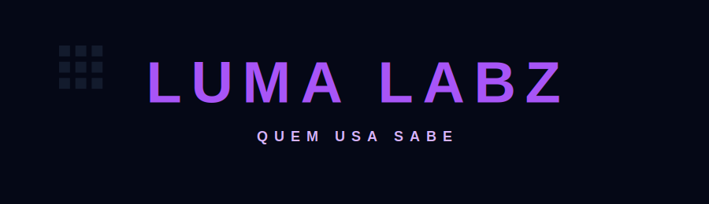

<div align="center">

# ✨ Luma Labz

Building digital solutions, and create utilities that people actually use.

🧪 Solution • 💻 Development • 🤖 Bots and Automation • ⚡ Satisfaction

<br>



</div>

---

## 🧪 About

Luma Labz is a startup focused on building solutions for discord, exploring niches, and transforming ideas into reality.

We move fast to satisfy our clients; those who use us know.

---

## ⚡ What we produce

- 💻 Solution Development
- 🤖 Bots and Automation
- 🧪 Solution Experiments
- 🎨 UI and UX
- 🚀 Rapid Prototyping

→ This is Luma Labz

---

## 🛠 Stack

<p>


</p>

---

## 📦 Current Focus

```txt
→ Build
→ Test
→ Improve
→ Production
```

---

<div align="center">

### Build → Test → Ship ⚡

</div>
